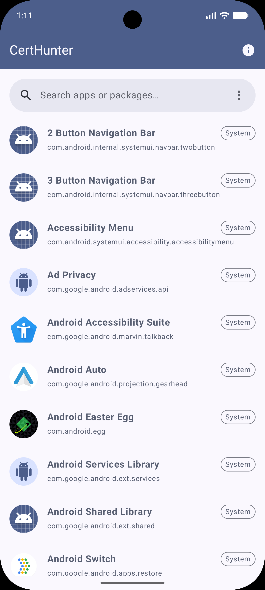
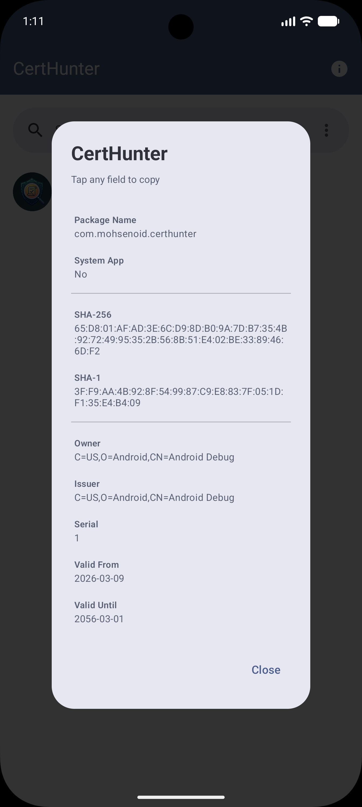

# CertHunter 🛡️

**CertHunter** is a developer utility for Android that reads the signing certificate directly from any app installed on the device — the only source that truly matters.

When you work across multiple flavors like dev, nightly, staging, and production, the real certificate is the one already on the phone. CertHunter surfaces it instantly, without digging through CI secrets, keystores, or old docs.

> See [openspec/project.md](openspec/project.md) for the full background on why this app exists.

## 🚀 Features

- **Browse installed apps** — lists all user and system applications with real-time search and sort by name, package, or install date.
- **SHA-256 & SHA-1 fingerprints** — copy in one tap for use with Google Pay, Firebase, Google Sign-In, Maps, or any service that requires certificate verification.
- **Full X.509 details** — owner (Subject DN), issuer, serial number, valid from / valid until.
- **Certificate validity state** — flags certificates as valid, expiring soon, or expired.
- **Key rotation history** — shows active and historical signers for apps that have rotated keys (Android 9+, API 28+).
- **Clipboard support** — tap any field to copy it instantly.
- **Modern UI** — Jetpack Compose + Material 3.

## 🛠️ Tech Stack

- **Language:** Kotlin
- **UI:** Jetpack Compose (Material 3)
- **Architecture:** MVI — ViewModel, State, Action, Event per screen
- **DI:** Koin 4.x
- **Navigation:** Navigation3
- **Concurrency:** Kotlin Coroutines + `DispatcherProvider`
- **Image loading:** Coil 2.x (custom `AppIconFetcher`)
- **Error handling:** [michael-bull/kotlin-result](https://github.com/michaelbull/kotlin-result) — two-parameter `Result<V, E>` (not `kotlin.Result`)
- **Security API:** `PackageManager`, `java.security.cert.X509Certificate`
- **Min SDK:** 24 (Android 7.0) · **Target SDK:** 37

### Testing

- JUnit 5 + Mockk + Turbine
- `FakeAppRepository` + `TestDispatcherProvider` for hermetic ViewModel tests
- Coroutine tests with `StandardTestDispatcher` + `advanceUntilIdle()`

## 📸 Screenshots

| **App List & Search**                               | **Certificate Details**                                   |
|-----------------------------------------------------|-----------------------------------------------------------|
|  |  |

## 🔑 Permissions & Privacy

```xml
<uses-permission android:name="android.permission.QUERY_ALL_PACKAGES" />
```

`QUERY_ALL_PACKAGES` is required on Android 11+ because discovering installed apps *is* the core function — without broad package visibility the app cannot operate at all.

All processing is done locally on the device. No data leaves the phone. The app has no Internet permission.

## 💻 Installation

1. Clone the repository:

   ```bash
   git clone https://github.com/mohsenoid/CertHunter.git
   ```

2. Open in **Android Studio** (Ladybug or newer recommended).

3. Sync Gradle and run on an emulator or physical device (Android 7.0+).

## 🧰 OpenSpec CLI

CertHunter uses [OpenSpec](https://github.com/Fission-AI/OpenSpec) for spec-driven changes. Install the CLI globally to scaffold and validate change proposals locally:

```bash
npm install -g @fission-ai/openspec
```

See [AGENTS.md](AGENTS.md) and [openspec/project.md](openspec/project.md) for the full workflow.

## 🔄 CI / CD

Every pull request runs **unit tests**, **Detekt lint**, and a **debug build** as parallel jobs. All three must pass before merging.

Releases are triggered manually — see the [Release Flow](#-release-flow) section below.

## 🧩 Code Highlight

CertHunter handles two `PackageManager` APIs across the full supported API range (24 → 37):

```kotlin
val packageInfo = if (Build.VERSION.SDK_INT >= Build.VERSION_CODES.P) {
    // Android 9+ (API 28+): active signers + full rotation history
    packageManager.getPackageInfo(packageName, PackageManager.GET_SIGNING_CERTIFICATES)
} else {
    // Android 7–8 (API 24–27): legacy API, no history
    packageManager.getPackageInfo(packageName, PackageManager.GET_SIGNATURES)
}
```

## 🚢 Release Flow

Releases are triggered manually via GitHub Actions — no tags are pushed by hand and no version numbers are typed. The workflow reads the current version from `build.gradle.kts`, increments it, builds the artifacts, and publishes everything automatically.

### Regular release (from `main`)

1. Ensure `main` is in a releasable state.
2. Go to **Actions → Release → Run workflow**.
3. Select branch **`main`** and choose the bump type:
   - **`minor`** — new feature release (e.g. `1.2.0` → `1.3.0`)
   - **`major`** — breaking change release (e.g. `1.3.0` → `2.0.0`)
   - **`patch`** — bug fix on current main (e.g. `1.3.0` → `1.3.1`)
4. The workflow will:
   - Read the current `versionName` from `app/build.gradle.kts` and compute the next version.
   - Patch `versionCode` / `versionName` in `app/build.gradle.kts`.
   - Build a signed AAB and APK.
   - Upload the AAB as a **draft** to the Play Store **internal testing** track.
   - Commit the version bump, create the tag (e.g. `v1.3.0`) at that commit, and push both.
   - Create a GitHub Release with the AAB and APK attached.
5. In **Google Play Console → Internal testing**, review and publish the draft to promote it to testers or production.

### Hotfix release (from a branch)

1. Create a branch from the last release tag: `git checkout -b hotfix/1.2.x v1.2.0`.
2. Cherry-pick or commit the fix onto that branch and push it.
3. Go to **Actions → Release → Run workflow**.
4. Select the **`hotfix/1.2.x`** branch and choose **`patch`**.
5. The workflow reads `1.2.0` from that branch's `build.gradle.kts`, bumps to `1.2.1`, and runs the same steps as above, tagging the hotfix commit.

### versionCode formula

`versionCode = MAJOR × 1,000,000 + MINOR × 1,000 + PATCH`

| Version | versionCode |
|---------|------------|
| 1.2.0   | 1002000    |
| 1.3.0   | 1003000    |
| 1.2.1   | 1002001    |

Hotfix codes are always lower than the next minor release, preserving correct Play Store ordering.

## 🤝 Contributing

Contributions are welcome! Please feel free to submit a Pull Request.

1. Fork the project
2. Create your feature branch (`git checkout -b feature/AmazingFeature`)
3. Commit your changes (`git commit -m 'Add some AmazingFeature'`)
4. Push to the branch (`git push origin feature/AmazingFeature`)
5. Open a Pull Request

## 📄 License

Copyright 2026 Mohsen Mirhoseini

Licensed under the Apache License, Version 2.0 (the "License"); you may not use this file except in compliance with the License. You may obtain a copy of the License at

http://www.apache.org/licenses/LICENSE-2.0

Unless required by applicable law or agreed to in writing, software distributed under the License is distributed on an "AS IS" BASIS, WITHOUT WARRANTIES OR CONDITIONS OF ANY KIND, either express or implied. See the License for the specific language governing permissions and limitations under the License.
